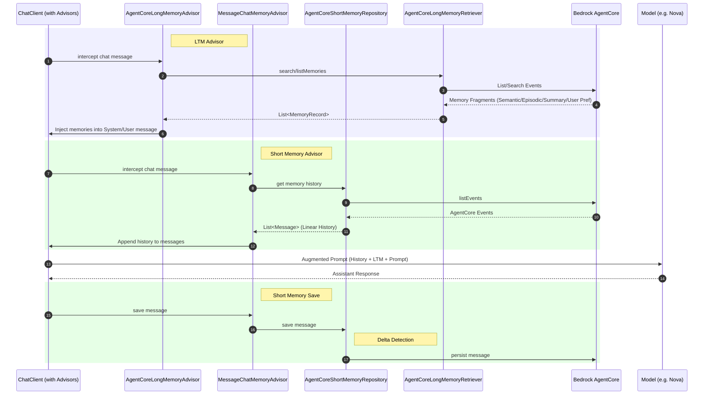

# Spring AI AgentCore Memory Example

A complete example demonstrating Amazon Bedrock AgentCore Short-Term & Long-Term Memory integration with Spring AI for persistent conversation history.

This example creates and uses the AgentCore Long-Term Memory Summary Strategy.

## Prerequisites

- Java 17+
- Maven 3.6+
- AWS credentials configured locally

## Architecture



## Quick Start

### Local Setup

1. Setup your local AWS credentials / auth

1. Create the AgentCore Memory:
    ```bash
    mvn spring-boot:test-run
    ```
1. Export the `AGENTCORE_MEMORY_ID` and `SUMMARY_STRATEGY_ID` env vars
1. Start the Spring web application
    ```bash
    mvn spring-boot:run
    ```
1. Test the application:
    ```bash
    # --- Short-Term Memory (STM) ---
    # Tell your name
    curl -X POST http://localhost:8080/api/short \
        -H "Content-Type: application/json" \
        -d '{"message": "My name is Andrei"}'
    
    # Ask for your name (memory recall)
    curl -X POST http://localhost:8080/api/short \
        -H "Content-Type: application/json" \
        -d '{"message": "What is my name?"}'

    # --- Long-Term Memory (LTM) ---
    # Ask something to be persisted in LTM
    curl -X POST http://localhost:8080/api/long \
        -H "Content-Type: application/json" \
        -d '{"message": "I love hiking in the Alps"}'

    # Get conversation history
    curl http://localhost:8080/api/history
 
    # Get stored LTM memories
    curl http://localhost:8080/api/memories

    # Clear conversation
    curl -X DELETE http://localhost:8080/api/history
    ```

## Cleanup

With the `AGENTCORE_MEMORY_ID` env var set, run:
```bash
mvn spring-boot:test-run
```
